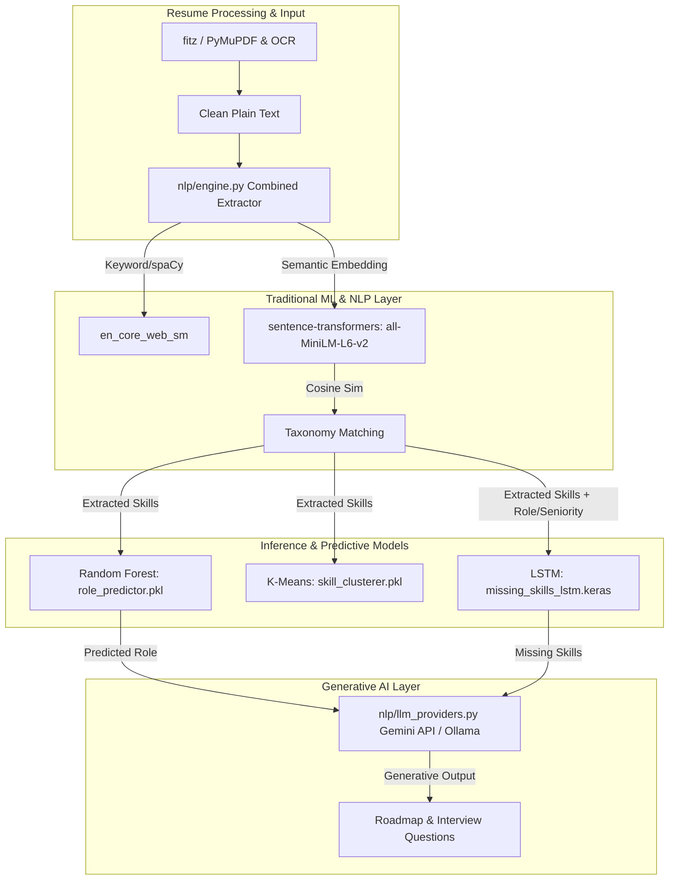

# Technical Model Inventory: AI Skills Gap Analyzer

This document catalogs and describes the machine learning models, natural language processing engines, and Generative AI integrations within the **AI Skills Gap Analyzer & Career Roadmap Platform**.

---

## 1. System Overview & Model Architecture
The AI Skills Gap Analyzer combines **traditional machine learning** (for classification and clustering), **deep learning** (for sequence prediction), **shallow NLP** (for keyword matching and tagging), and **Generative AI / LLMs** (for dynamic roadmap creation and interview generation).

A centralized class `MLModelLoader` (located in `backend/ml_loader.py`) handles versioned model loading, caching, and state management, binding the loaded models to the FastAPI application state at server startup.

---

## 2. Model Catalog & Technical Details

### 2.1. Role Predictor (Classification)
*   **Purpose:** Classifies the candidate's current role based on their extracted skills profile.
*   **Source Code:**
    *   Training: `backend/models/ml_training/train_role_predictor.py`
    *   Inference: `backend/ml_inference.py`
*   **Model Architecture:** Scikit-Learn `RandomForestClassifier` with balanced class weights.
*   **Data Representation:**
    *   **Input Features:** Binary one-hot encoded representation of input skills using `MultiLabelBinarizer` (approx. 140+ dimensions).
    *   **Target Labels:** Multi-class classification target representing job roles encoded using `LabelEncoder`.
*   **Hyperparameters (Swept via GridSearchCV):**
    *   `n_estimators`: `[100, 200, 300]` (default: 300)
    *   `max_depth`: `[10, 15, 20, None]`
    *   `min_samples_split`: `[2, 5, 10]`
    *   `max_features`: `['sqrt', 'log2']`
*   **Quality Metrics:**
    *   Target Accuracy: `> 0.85`
    *   Target Per-role Precision & Recall: `> 0.80`
    *   Target Brier Score (calibration): `< 0.15`
*   **Artifacts Generated:**
    *   `models/ml_models/v1.0/role_predictor.pkl` (Serialized Model)
    *   `models/ml_models/v1.0/config.json` (Feature names and role labels mapping)

---

### 2.2. Skill Clusterer (Unsupervised Learning)
*   **Purpose:** Categorizes detected skills into four output domains (`frontend`, `backend`, `devops`, `data`).
*   **Source Code:**
    *   Training: `backend/models/ml_training/train_skill_clusterer.py`
    *   Inference: `backend/nlp/engine.py` (via `categorize_skills`)
*   **Model Architecture:** Scikit-Learn `KMeans` Clustering.
*   **Data Representation:**
    *   **Input Features:** 384-dimensional dense semantic vectors encoded via `SentenceTransformer` (`all-MiniLM-L6-v2`).
*   **Configuration:**
    *   Number of clusters ($K$): 13 (derived using optimal Silhouette/Elbow search).
    *   Cluster-to-Domain Map: Hardcoded mapping inside `engine.py` associating cluster IDs to output domains (e.g. cluster `0` $\rightarrow$ `frontend`, `2` $\rightarrow$ `backend`, `3` $\rightarrow$ `devops`, etc.).
*   **Quality Metrics:**
    *   Silhouette Score Target: `> 0.6`
    *   Davies-Bouldin Index Target: `< 1.0`
    *   Calinski-Harabasz Index Target: `> 100`
*   **Artifacts Generated:**
    *   `models/ml_models/v1.0/skill_clusterer.pkl` (Serialized Model)

---

### 2.3. Missing Skills Predictor (Deep Learning Sequence Model)
*   **Purpose:** Predicts high-probability missing skills based on a candidate's current skills profile, target role, and seniority level.
*   **Source Code:**
    *   Training: `backend/models/ml_training/train_missing_skills_lstm.py`
    *   Inference: `backend/ml_inference.py`
*   **Model Architecture:** Dual-Input Keras Functional API model.
    *   **Branch A (Skills Sequence):**
        *   Input Shape: `(20, 384)` (Sequence of up to 20 candidate skills encoded as 384-dim dense vectors).
        *   Layers: `Masking(mask_value=0.0)` $\rightarrow$ `LSTM(128, return_sequences=True)` $\rightarrow$ `LSTM(64)`.
    *   **Branch B (Context Metadata):**
        *   Input Shape: `(meta_dim,)` (One-hot encoded target role and seniority level, typically ~67 features).
        *   Layers: `Dense(32, activation="relu")`.
    *   **Merge Nexus:**
        *   Layers: `Concatenate` $\rightarrow$ `Dense(256, activation="relu")` $\rightarrow$ `Dropout(0.2)` $\rightarrow$ `Dense(50, activation="sigmoid")`.
*   **Optimization:**
    *   Loss function: `binary_crossentropy`
    *   Optimizer: `Adam(lr=0.001)`
    *   Early Stopping: Monitored on `val_loss` (patience=5).
*   **Quality Metrics:**
    *   Recall@10: `> 0.75`
    *   Recall@20: `> 0.85`
    *   Mean Reciprocal Rank (MRR): `> 0.80`
    *   Inference Latency: `< 100 ms`
*   **Artifacts Generated:**
    *   `models/ml_models/v1.0/missing_skills_lstm.keras` (Native Keras Model format)
    *   `models/ml_models/v1.0/missing_skills_mlb.pkl` (Scikit-Learn MultiLabelBinarizer for target vocab)
    *   `models/ml_models/v1.0/role_encoder.pkl` (Scikit-Learn OneHotEncoder for target roles)
    *   `models/ml_models/v1.0/seniority_encoder.pkl` (Scikit-Learn OneHotEncoder for seniority levels)

---

### 2.4. NLP & Embedding Engines
*   **spaCy (Shallow NLP):**
    *   **Model:** `en_core_web_sm` (v3.8.0).
    *   **Usage:** Tokenizes and parses cleaned resume text to match skills against a predefined set of known keywords using noun-chunks and token extraction.
*   **Sentence-Transformers (Semantic Matching):**
    *   **Model:** `all-MiniLM-L6-v2` (384-dimensional dense vectors).
    *   **Usage:**
        *   Encodes overlapping sentence-level chunks of resume text and compares them against a pre-embedded skill taxonomy (`models/data/skill_categories.json`) via cosine similarity (dot product on normalized vectors) with a default threshold of `0.75`.
        *   Encodes skill terms for input to the `skill_clusterer` and `missing_skills_lstm` pipelines.

---

## 3. Generative AI (LLM) Integrations

Generative tasks are handled by a pluggable provider interface in `backend/nlp/llm_providers.py` utilizing the `google-genai` SDK.

### 3.1. Models & Fallbacks
*   **Primary model:** `gemini-2.0-flash`
*   **Alternative / Lite models:** `gemini-2.5-flash`, `gemini-2.5-flash-lite`, `gemini-2.0-flash-lite`, `gemini-1.5-flash`
*   **Local Fallback:** Support for Ollama models (such as `llama3.2` or other user-defined tags) if `LLM_PROVIDER` is set to `"ollama"`.

### 3.2. Role-specific LLM Integration
1.  **Custom Role Skills Resolution (`role_skills_service.py`):**
    *   Uses Gemini to dynamically retrieve canonical/typical skills for custom job roles.
2.  **Domain Classification (`mastery_service.py`):**
    *   Uses Gemini to classify novel skills into domain buckets if the skills are not recognized by the internal taxonomy or local rules.
3.  **Mock Interview Session (`ai_interview_service.py`):**
    *   Engages in a chat loop to generate personalized, context-aware technical mock interview questions targeting the candidate's gap skills.
4.  **Market Data Bootstrapping (`market_service.py`):**
    *   Attempts to use Gemini to bootstrap market demand data, trending skills, and salary ranges for newly searched, unknown job roles.

---

## 4. Key Environment Configurations

The behavior of these models is regulated by the following environment variables:

| Variable Name | Default Value | Description |
|---|---|---|
| `ML_MODEL_VERSION` | `v1.0` | Target directory for loading serialised models. |
| `LLM_PROVIDER` | `gemini` | Generative provider (`gemini` or `ollama`). |
| `GEMINI_API_KEY` | None | API credential for Google Gemini. |
| `OLLAMA_BASE_URL` | `http://localhost:11434` | Endpoint for local Ollama server. |
| `OLLAMA_MODEL` | `llama3.2` | Model name to query when using Ollama. |
| `NLP_SEMANTIC_THRESHOLD` | `0.75` | Cosine similarity threshold for semantic extraction. |
| `NLP_USE_SEMANTIC_EXTRACTION`| `True` | Global feature flag for semantic skill extraction. |

---

## 5. Structural Observations & Code Anomaly

### Reference Bug in `market_service.py`
During audit of the market service pipeline (`backend/services/market_service.py`), we identified a missing function implementation:
*   On line `522`, `get_demand_for_role(role)` calls an asynchronous helper named `_fetch_gemini_market_data(role)` to bootstrap data when Adzuna search yields no results.
*   **Finding:** The function `_fetch_gemini_market_data` is called but **is not defined anywhere in `market_service.py` or imported in the module**. This represents an unresolved reference bug that will trigger a `NameError` if a user attempts to search for a new role that falls back to Gemini data.
